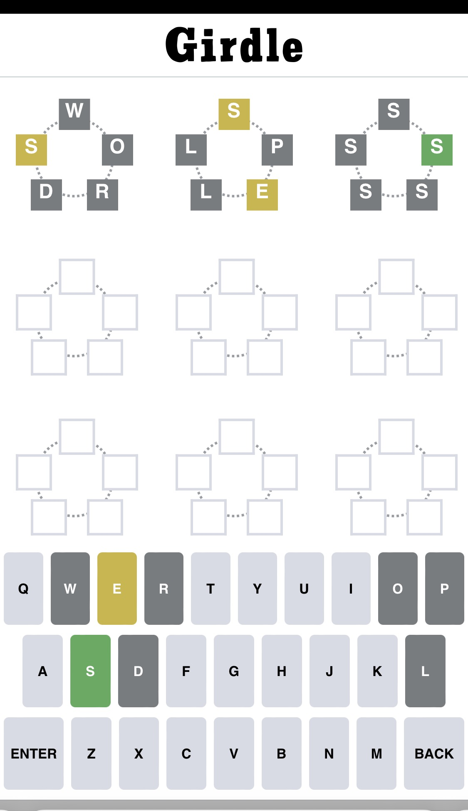

# Girdle
A Wordle knockoff for people who like circles.

In Girdle, the secret word wraps clockwise in a circle.
The word can start at any point in the circle, but you must start entering letters from the top square.

You have 9 chances to guess the word, and you're allowed to enter non-valid words.

 

